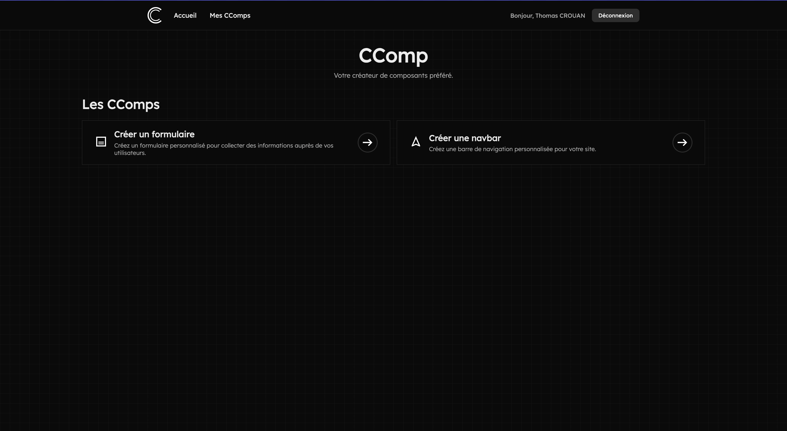

<p align="center">
  
</p>

<h1 align="center">
  CComp — Component Creation Platform
</h1>

<p align="center">
  
  
  
  
</p>

## Présentation du projet

**CComp** est une plateforme de création de composants UI (formulaires, navbar) construite avec une architecture **monorepo moderne**.  

L’objectif est de proposer un environnement :

- Modulaire et maintenable  
- Réutilisable à travers plusieurs applications  
- Compatible avec React et Next.js  
- Avec authentification sécurisée et gestion de sessions  

## Équipe

Ce projet est développé et maintenu par l’équipe **CComp**.  

- **Mathis Gaudré** 
- **Gabriel MARICHAL** 
- **Thomas CROUAN** 


## Architecture

Le projet utilise **Turborepo** avec npm workspaces pour organiser le code en **applications** et **packages partagés**.

```
├── apps/
│   ├── web/          # Frontend Next.js 16 (port 3000)
│   └── api/          # Backend Fastify 5 (port 3001)
└── packages/
    ├── ui/           # Librairie de composants React partagés
    ├── auth/         # Authentification avec Better Auth
    ├── db/           # ORM Drizzle + schémas PostgreSQL
    ├── api-types/    # Types Zod partagés entre API et frontend
    ├── eslint-config/# Configurations ESLint partagées
    └── typescript-config/  # Configurations TypeScript partagées
```

## Stack Technique

### Frontend

- **Next.js 16.1.0** – Framework React avec App Router  
- **React 19.2.0** – Bibliothèque UI  
- **TypeScript 5.9.2** – Typage statique  

### Backend

- **Fastify 5.6.2** – Framework Node.js haute performance  
- **Zod 4.1.13** – Validation de schémas et types  

### Base de données

- **Drizzle ORM 0.45.1** – ORM type-safe  
- **PostgreSQL 17** – Base de données relationnelle  
- **Drizzle Kit** – Migrations et gestion de la BDD  

### Authentification

- **Better Auth 1.4.18** – Inscription / connexion et gestion des sessions  
- Routes protégées avec adaptateur Drizzle  

### Outils

- **Turborepo 2.7.4** – Task runner et système de build  
- **ESLint 9.39.1** – Linting du code  
- **Prettier 3.7.4** – Formatage automatique  
- **Knip 5.81.0** – Détection du code inutilisé  

## Fonctionnalités

### 1. Créateur de formulaires

Interface pour créer des formulaires personnalisés avec support de plusieurs librairies :  

- Vanilla (natif)  
- React Hook Form  
- TanStack Form  

### 2. Générateur de navbar

Outil pour créer des composants de navigation personnalisables.

### 3. Authentification

- Inscription / Connexion par email/mot de passe  
- Gestion des sessions  
- Routes protégées  

### 4. Librairie de composants

Composants UI partagés (Button, Card, Code, etc.) utilisables dans toutes les applications.

--- 

Développé avec Turborepo et maintenu par l'équipe CComp.